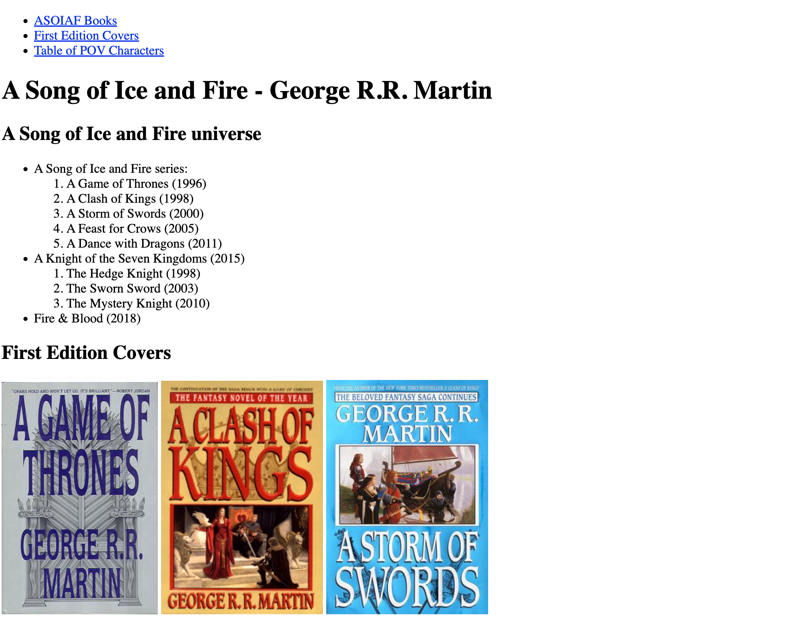
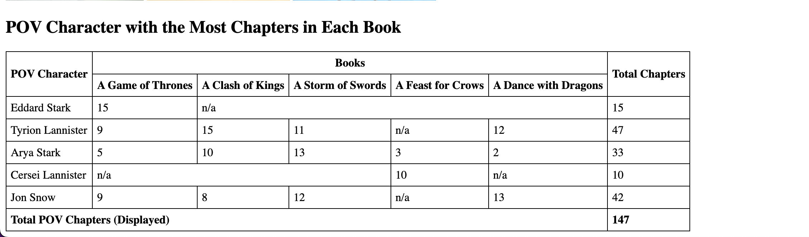
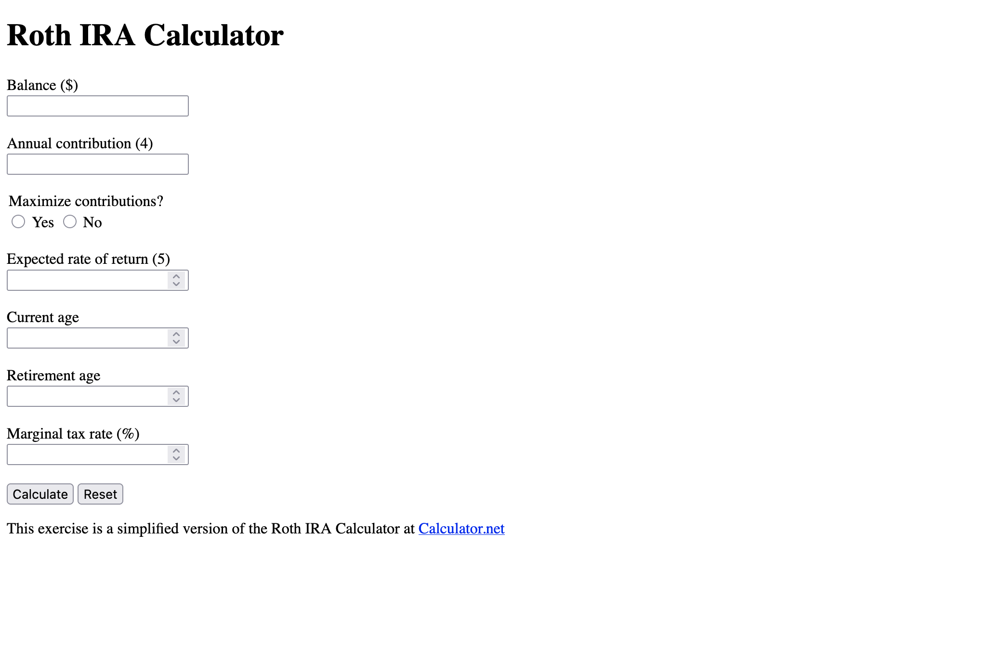

# HTML Exercises

- [Exercise 01 - Books](#ex01)
- [Exercise 02 - Form](#ex02)

##  Exercise 01 - Books

Recreate the snapshots below. Note: While there are two screenshots, they belong on the same web page.

As you can see in the screenshots, you will need to implement navigation, main and secondary headings, nested lists, images, and a table. Make sure to use semantic elements to create everything on the page.

The links to the images are listed from the Wikipedia page for each book:

- https://upload.wikimedia.org/wikipedia/en/9/93/AGameOfThrones.jpg
- https://upload.wikimedia.org/wikipedia/en/3/39/AClashOfKings.jpg
- https://upload.wikimedia.org/wikipedia/en/2/24/AStormOfSwords.jpg

##  Exercise 02 - Form

Recreate the snapshot below. As you can see in the screenshot, you will need to create a form with several input elements. Make sure to use the correct types of input elements.

